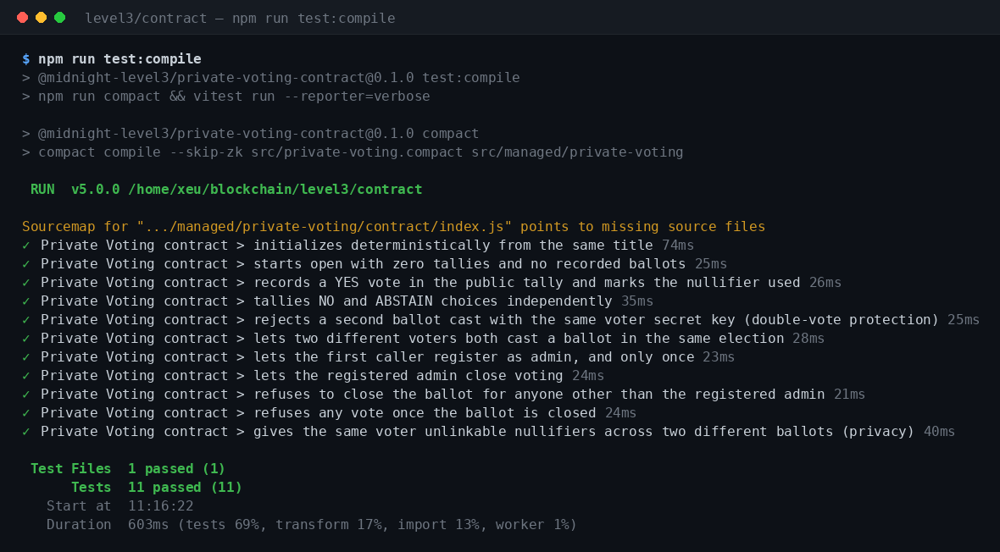

# Private Voting — Midnight Level 3

[](https://github.com/DONG2209/midnight-private-voting/actions/workflows/level3-ci.yml)
[](./LICENSE)

> **Idea from the provided list:** Private Voting — anonymous ballots with publicly verifiable tallies.
> Full product proposal: **[PROPOSAL.md](./PROPOSAL.md)**.

Half the moon is lit, half is shadow — and exactly that much of this dApp is disclosed. Anyone can read the
running tally and verify it on chain; no one, including the contract itself, can tell who cast which ballot.

```
"Adopt the new community charter?"        ← public
   YES: 2   NO: 1   ABSTAIN: 1             ← public, updates live
   nullifiers used: [a91f…, 7c02…, …]      ← public, but unlinkable to any voter
   who voted YES                           ← never on chain, never disclosed
```

## Contents

- [What this is](#what-this-is)
- [Repository layout](#repository-layout)
- [Quickstart](#quickstart)
- [Scripts](#scripts)
- [The contract](#the-contract)
- [Privacy model](#privacy-model)
- [Tests](#tests)
- [CI/CD](#cicd)
- [The frontend (sandbox dApp)](#the-frontend-sandbox-dapp)
- [Going from sandbox to testnet](#going-from-sandbox-to-testnet)
- [Live demo & video](#live-demo--video)
- [Submission checklist](#submission-checklist)

## What this is

A small, real Compact contract (`contract/src/private-voting.compact`) implementing one ballot: three choices
(YES / NO / ABSTAIN), a public running tally, double-vote prevention via zero-knowledge nullifiers, and a
self-registering admin who can close the vote — all compiled with the actual Midnight `compact` toolchain and
exercised by a real test suite (not mocked).

A companion browser app (`frontend/`) runs that exact compiled contract client-side, so you can watch the whole
flow — deploy, vote, get rejected for double-voting, close the ballot, read the raw public ledger — with nothing
to install, no wallet, and no network. See [Going from sandbox to testnet](#going-from-sandbox-to-testnet) for
what changes when you point this at a live Midnight network.

## Repository layout

```
level3/
├── contract/                  Compact contract + TypeScript test suite
│   ├── src/private-voting.compact
│   ├── src/witnesses.ts       Private-state / witness plumbing
│   ├── src/ballot-client.ts   Reusable client used by both tests and the frontend
│   └── src/test/private-voting.test.ts
├── frontend/                  Vite + TypeScript browser sandbox
│   └── src/main.ts
├── docs/screenshots/          Test-output screenshot for the submission checklist
├── PROPOSAL.md                 Product proposal (required reading before the code)
└── .github/workflows/level3-ci.yml   (repo root) — compile + test on every push
```

This is an npm workspaces monorepo (`contract` + `frontend`) so the frontend can import the contract package
directly — see [`package.json`](./package.json).

## Quickstart

Prerequisites: **Node.js 22+** and the **Compact developer tools**.

```bash
# 1. Install the Compact compiler (once per machine)
curl --proto '=https' --tlsv1.2 -LsSf \
  https://github.com/midnightntwrk/compact/releases/latest/download/compact-installer.sh | sh
source ~/.bashrc   # or ~/.zshrc
compact update 0.34.0

# 2. Install workspace dependencies
cd level3
npm install

# 3. Compile the contract, then run the tests
npm run compact
npm run test

# 4. Try the browser sandbox
npm run dev --workspace frontend   # http://localhost:5173
```

## Scripts

Run from `level3/` unless noted.

| Command | What it does |
|---|---|
| `npm run compact` | Compiles `private-voting.compact` → `contract/src/managed/` (skips ZK proving-key generation for speed; see `npm run compact:zk --workspace contract` for the full build) |
| `npm run test` | Runs the 11-test Vitest suite against the compiled contract |
| `npm run test:compile --workspace contract` | Compiles *and* tests in one step (what CI runs) |
| `npm run typecheck` | Type-checks both workspaces |
| `npm run build` | Builds the contract package and the frontend for production |
| `npm run dev --workspace frontend` | Starts the sandbox dApp locally |

## The contract

`contract/src/private-voting.compact` — three exported circuits:

| Circuit | Purpose |
|---|---|
| `castVote(choice)` | Casts one anonymous ballot. Proves the caller knows a voter secret key whose nullifier hasn't been used in *this* ballot, then updates the public tally. |
| `registerAdmin()` | Binds whoever calls it first as the ballot admin, by publishing `persistentHash(tag, contract address, adminSecretKey)` — the key itself never appears on chain. |
| `closeBallot()` | Only succeeds if the caller can reproduce the registered admin's commitment. |

Two internal (non-exported) helper circuits, `voteNullifier` and `adminHash`, mix in this contract's own address
(`kernel.self()`) so the *same* secret key produces **unrelated** public nullifiers in two different ballot
deployments — see [Privacy model](#privacy-model).

## Privacy model

This is the part every submission in this cohort has to state explicitly. For the Private Voting contract:

### An observer CAN learn

- The ballot's title and open/closed status (`title`, `status` — public ledger fields).
- The running YES / NO / ABSTAIN tallies, updated the instant a vote lands.
- The total number of ballots cast (`ballotsCast`).
- The full set of nullifiers used so far — raw 32-byte values, and how many there are.
- That some vote just moved the tally in a particular direction, at a particular time.
- Whether an admin has been registered, and a one-way hash of their secret key (`adminCommitment`) — not the key.

### An observer CANNOT learn

- **Who** cast any specific ballot. A vote only ever proves "the caller knows a voter secret key," never which
  key, wallet, or person.
- **Which** tally change belongs to **which** nullifier — a nullifier is just an opaque 32 bytes with no link to
  an identity or a choice.
- Whether the **same person** voted in two **different** ballots. `voteNullifier` hashes in `kernel.self()` (this
  contract's own address), so one voter's key produces unrelated nullifiers per deployment — see the
  `gives the same voter unlinkable nullifiers across two different ballots` test.
- The **admin's secret key**, ever — `closeBallot`/`registerAdmin` only ever disclose a hash of it
  (`disclose(adminHash(adminSecretKey()))`), never the key itself.
- Anything at all about a vote that gets **rejected** (e.g. a double-vote attempt) — a failed circuit call proves
  nothing and mutates no public state; see `rejects a second ballot cast with the same voter secret key`.

Every place a witness (private) value is allowed to influence public state is marked with an explicit
`disclose(...)` call in `private-voting.compact` — that is Compact's compiler enforcing this boundary at compile
time, not just a convention.

## Tests

```
$ npm run test:compile --workspace contract

 ✓ Private Voting contract > initializes deterministically from the same title
 ✓ Private Voting contract > starts open with zero tallies and no recorded ballots
 ✓ Private Voting contract > records a YES vote in the public tally and marks the nullifier used
 ✓ Private Voting contract > tallies NO and ABSTAIN choices independently
 ✓ Private Voting contract > rejects a second ballot cast with the same voter secret key (double-vote protection)
 ✓ Private Voting contract > lets two different voters both cast a ballot in the same election
 ✓ Private Voting contract > lets the first caller register as admin, and only once
 ✓ Private Voting contract > lets the registered admin close voting
 ✓ Private Voting contract > refuses to close the ballot for anyone other than the registered admin
 ✓ Private Voting contract > refuses any vote once the ballot is closed
 ✓ Private Voting contract > gives the same voter unlinkable nullifiers across two different ballots (privacy)

 Test Files  1 passed (1)
      Tests  11 passed (11)
```



These tests run against the **real compiled contract** via `@midnight-ntwrk/compact-runtime`'s local circuit
simulator (`contract/src/ballot-client.ts`) — no mocking of contract logic, no live network required. That's also
why they're fast enough to run on every push.

## CI/CD

[`.github/workflows/level3-ci.yml`](../.github/workflows/level3-ci.yml) (repo root) runs on every push and pull
request that touches `level3/`:

1. Installs the real Compact toolchain (same installer command as above).
2. `npm ci` — installs workspace dependencies from the committed lockfile.
3. Compiles the contract (`npm run compact`).
4. Type-checks both workspaces.
5. Runs the test suite.
6. Builds the contract package and the frontend, uploading the frontend build as a workflow artifact.

See the badge at the top of this file for the latest run.

## The frontend (sandbox dApp)

`frontend/` is a small Vite + TypeScript app, no framework. It:

- Detects and connects to a Midnight-compatible wallet via `@midnight-ntwrk/dapp-connector-api`
  (`frontend/src/wallet.ts`) — real detection/connect code, exercised against whatever wallet extension you have
  installed.
- Runs the **same compiled contract** as the tests, entirely client-side, so you can deploy a ballot, switch
  between voter identities, cast votes, watch double-voting get rejected, register an admin, and close the
  ballot — all with zero backend infrastructure.
- Renders the raw public ledger of your ballot in a JSON panel, so the privacy claims above are something you can
  literally read off the screen rather than take on faith.

Because it's 100% client-side and static, `npm run build --workspace frontend` produces a `frontend/dist/` you
can host anywhere static files are welcome (GitHub Pages, Vercel, Netlify, S3) with no server-side component —
that's what should sit behind your live demo link.

## Going from sandbox to testnet

The sandbox above proves the contract's logic and privacy properties. Taking it from "runs in this browser tab"
to "runs against a live Midnight network" is a separate, well-defined next step that this submission scopes out
deliberately rather than fake:

1. Deploy the compiled contract to your target network (e.g. testnet) using
   [`@midnight-ntwrk/midnight-js-contracts`](https://www.npmjs.com/package/@midnight-ntwrk/midnight-js-contracts)'
   `deployContract`, with `publicDataProvider`/`proofProvider`/`privateStateProvider`/`zkConfigProvider`
   instances pointed at that network's indexer, proof server, and ZK artifacts — Midnight's own tutorials
   (`docs.midnight.network`, e.g. the Bulletin Board and Leaderboard walkthroughs) show the current wiring for
   whichever SDK version you're on; this stack is still pre-1.0 and its provider APIs move quickly.
2. Record the deployed `contractAddress` and drop it into `frontend/.env` (see `frontend/.env.example`).
3. Replace `BallotClient` (which drives `@midnight-ntwrk/compact-runtime` directly, entirely locally) with
   `findDeployedContract` from the package above, so `castVote`/`registerAdmin`/`closeBallot` build, prove, and
   submit a real transaction through the wallet connected in step 1 instead of mutating in-memory state.

We scoped this out rather than ship unverified plumbing: this repo's toolchain is genuinely pre-1.0 (the
installed compiler is `0.34.0`, the ledger is `9.1.0.0-rc.3`), and the exact provider-construction code is the
part most likely to already be stale by the time you read this. Everything else in this README — the contract,
its tests, and the CI pipeline — was executed in full while writing this submission.

## Live demo & video

- **Live demo:** **<https://claude.ai/code/artifact/3d138538-bdc0-4370-8fbe-423eb42e9713>** — the exact
  `frontend/dist/` build above, republished as a static page. Deploy a ballot, vote, and watch the tallies and raw
  public ledger update in real time; nothing to install. (It's a Claude Artifact preview rather than a
  project-owned domain — feel free to also deploy `frontend/dist/` to GitHub Pages/Vercel/Netlify for a
  permanent, project-owned URL and swap it in here.)
- **Demo video (≤1 min):** record `npm run dev --workspace frontend` (or the live demo above) walking through
  deploy → vote → rejected double-vote → register admin → close ballot → the raw public-ledger panel, and link it
  here: `TODO — add your video link`.

## Submission checklist

| Requirement | Status |
|---|---|
| Fully functional dApp using Midnight's privacy model | ✅ contract + sandbox frontend, both real and run in this repo |
| Minimum 3 tests passing | ✅ 11 tests, see [Tests](#tests) |
| CI/CD pipeline (workflow file + passing runs) | ✅ workflow committed — passing runs appear once pushed to GitHub |
| Approved idea from the provided list | ✅ Private Voting — see [PROPOSAL.md](./PROPOSAL.md) |
| Public GitHub repo with complete README | ⬜ push this repo and make it public |
| Live demo link | ✅ see [Live demo & video](#live-demo--video) |
| Screenshot: 3+ tests passing | ✅ [`docs/screenshots/tests-passing.png`](./docs/screenshots/tests-passing.png) |
| CI/CD badge or workflow with passing runs | ✅ badge above; will go green after the first push |
| Demo video (1 min) | ⬜ record and add the link above |
| README "privacy model" section | ✅ see [Privacy model](#privacy-model) |
| Product proposal submitted | ✅ [PROPOSAL.md](./PROPOSAL.md) |
| Minimum 10 meaningful commits | ✅ see `git log` |

## License

Apache-2.0 — see [`LICENSE`](./LICENSE).
